# Change Management
This is a process to manage Change Requests using xMatters to automate delivery and processing of approval stages.
Manual approvals process is also supported.
This has been created as a stand-alone feature driven by xMatters but also allows for integration with a third party management system.

<kbd>
  
</kbd>

# Pre-Requisites
* xMatters account - If you don't have one, [get one](https://www.xmatters.com)!

# Files
* [ChangeManagement.zip](ChangeManagement.zip) - This is the Change Management communication plan.  All functionality is delivered with this one file.

# How it works
A Change Manager initiates the 'Request for Change' form entering pertinent details describing the change.  
Properties are available to enter a Change ticket number, change type (Normal or Emergency), status, summary, description, impact, risk, priority, affected service, CI, category, assigned group, backout plan and three sets of approvers
1. Manager approvers
2. Stakeholder approvers
3. CAB approvers

A check box also exists to detail if approvals are automated or not.

Once the original 'Request for Change' form has been submitted the process checks to see if
1. this is a normal change
2. we are set to automatically manage approvals
3. the change is in an approval status

If the above conditions are true the system will identify the selected approval groups for the respective status and send a notification requesting approval.

Recipients of the approval notification can **Approve** or **Decline** the request.  Each response option allows for comments to be added after the response has been sent.

If the response is positive, i.e. approved, the system checks to see if there are any subsequent approval stages defined and forwards a new notification to that set of defined approver group(s).

The system continues this automated process until such time as there are no subsequent approval stages or until we receive a 'Decline' response.

All comments submitted from each approval event are written back to the original 'Request for Change' event so the change manager can quickly see responses from each approval stage.

Once all approval stages are complete the change manager can manually duplicate the original 'Request for Change' event and progress the change through the remaining status.

If the original 'Request for Change' event is not configured for auto-approval the change manager can progress the change through each necessary status via manually duplicating the event a selecting the relevant status.

# Installation
Import the above communication plan (link: http://help.xmatters.com/OnDemand/xmodwelcome/communicationplanbuilder/exportcommplan.htm)

## xMatters set up
Once the communication plan has been imported:
### Configure Forms
1. Configure *Sender Permissions* on the 'Request for Change' form to allow respective 'Change Managers' to initiate the process
2. Ensure 'Request for Change' form is enabled for WEB access (and possibly Mobile if so desired)
3. Ensure 'Approval History' and 'Change Approval' forms are enabled for 'Web Service' access

### Configure Inbound Integrations
1. Open each Inbound Integration and ensure they are configured for *URL Authentication*
<kbd>
  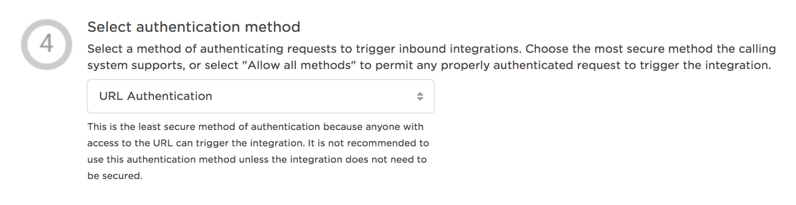
</kbd>

2. Copy the Integration URL for the **Inbound - Approval History** and **Inbound - Change Approval** inbound integrations as we will need these details when configuring Constants
<kbd>
  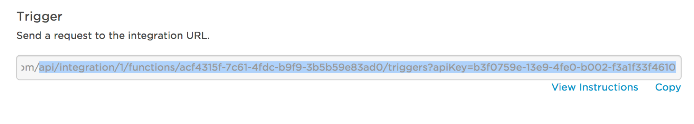
</kbd>

### Configure Constants
Several constants are used to enable this process
1. **approval history form api**

This is used to identify the inbound integration URL for the Approval History form.
Paste the URL copied from 'Inbound - Approval History' integration.

<kbd>
  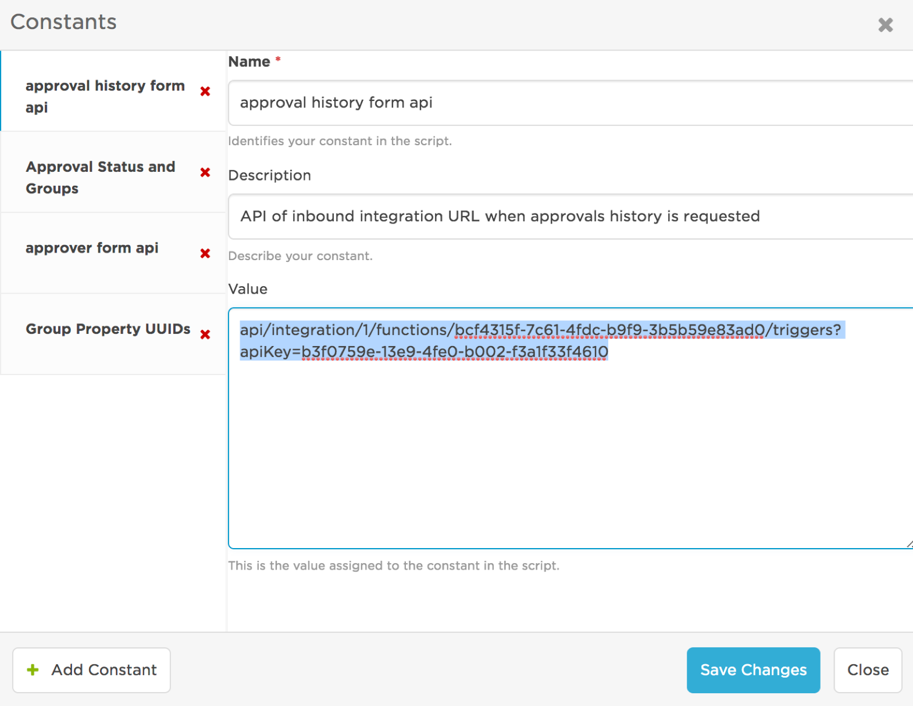
</kbd>

2. **approver form api**

This is used to identify the inbound integration URL for the Approval form sent to respective approvers.
Paste the URL copied from 'Inbound - Change Approval' integration.

<kbd>
  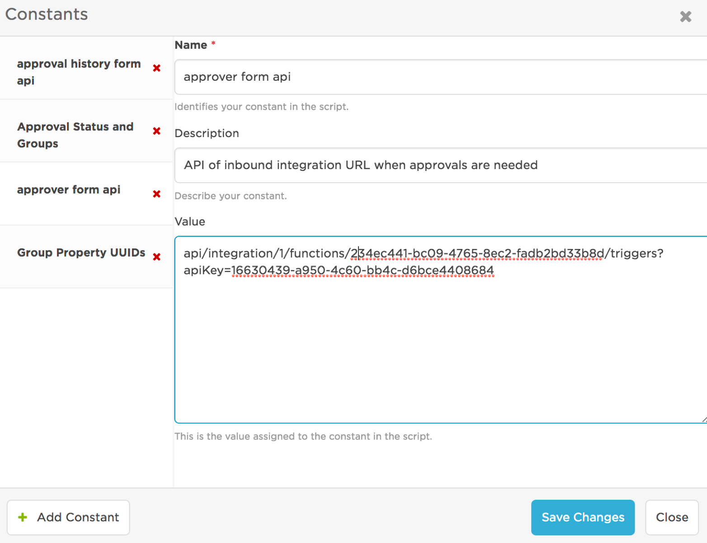
</kbd>

3. **Approval Status and Groups**

This constant is used to allow you to map *your* approval status to the form property storing respective approvers for that status.  

For example, your first approval status may not be 'Manager Approval' but might be 'Pre-Approval'.  In this case you can modify the 'Status' list property to enter your approval status supporting *your process terminology*.  For consistency you may want to create a new 'Pre-Approval' approver list property to identify the approvers for this status.

The 'Approval Status and Groups' constant allows you to map your status to your approval property. i.e.
<kbd>
  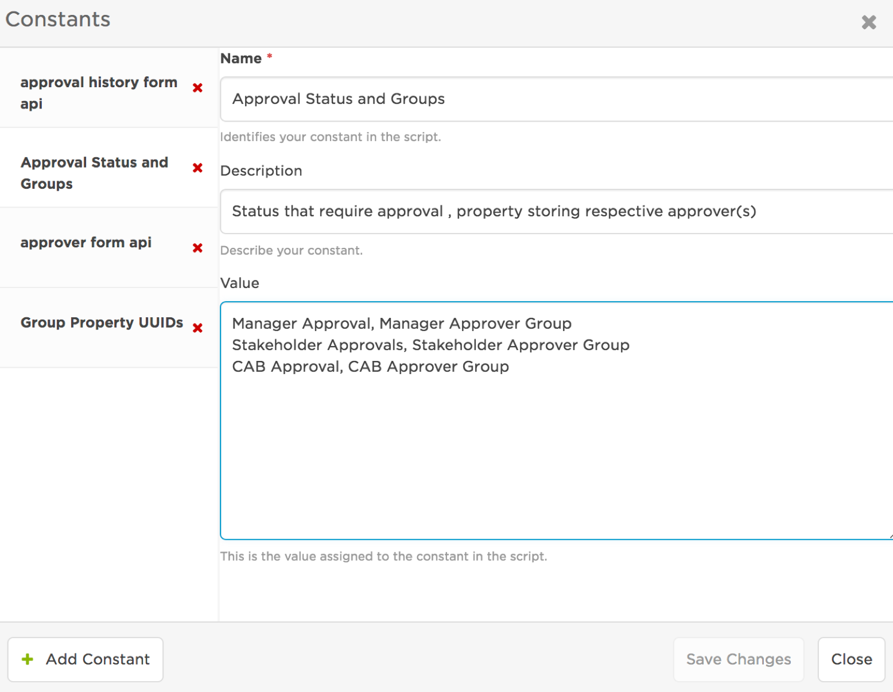
</kbd>

or

<kbd>
  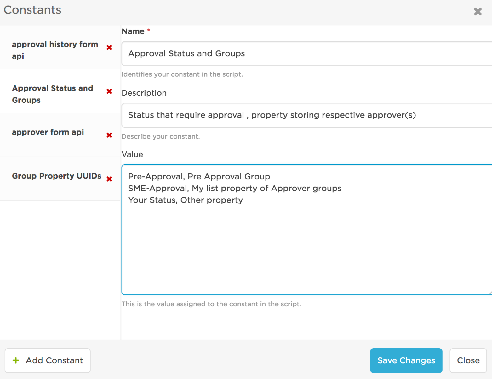
</kbd>

4. **Group Property UUIDs**

This constant is used to auto-populate your approver list properties with your groups.  
If you want to copy all your groups into your approver properties you can access the unique identifier for your approver properties and enter them in this constant.
To access the unique identifier go to the 'Properties' section and edit your respective property:
<kbd>
  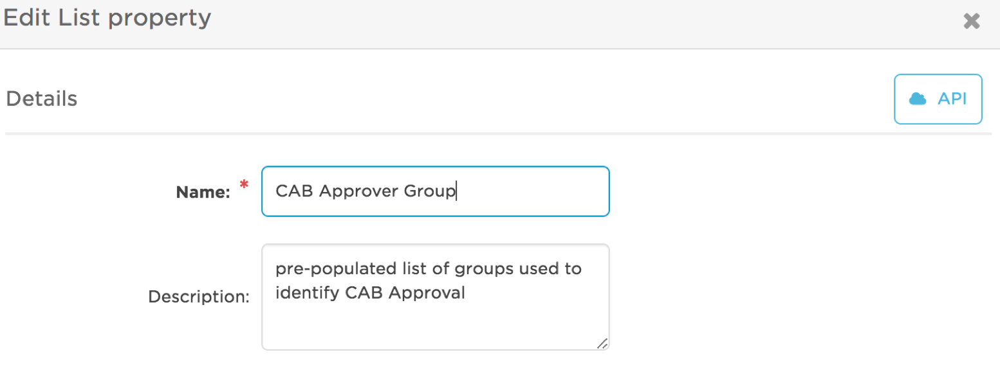
</kbd>

Then select the 'API' button and copy the UUID into the constant.

<kbd>
  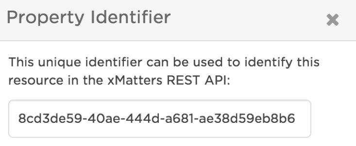
</kbd>

You can comma-delimit as many approver properties as required for your process.
<kbd>
  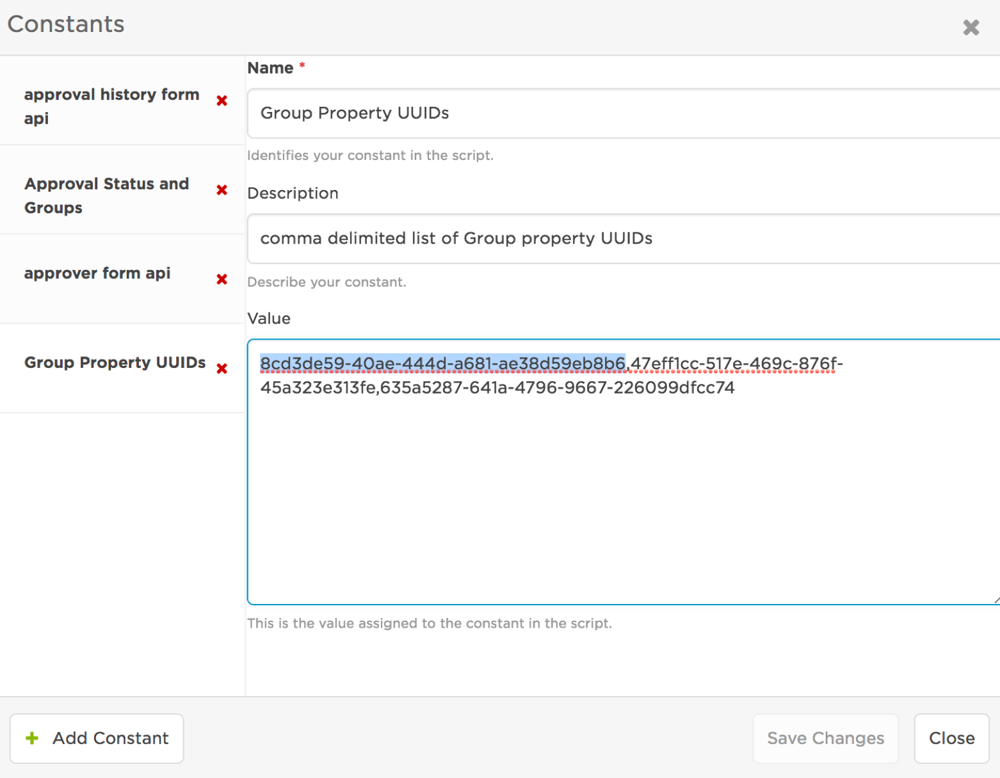
</kbd>

To populate your group properties simply initiate an empty 'Request for Change' form.  When this event is processed it will update each of the defined list properties with your group names.

Each time the form runs the group properties list is refreshed

NB: You can manually populate these approver properties if you wish.  If you do manually populate them you must ensure to type the group name *exactly* as it appears on the group.

If this constant is empty the process does not try to populate these properties.

# Lets take a look...

1. initiate the form:

<kbd>
  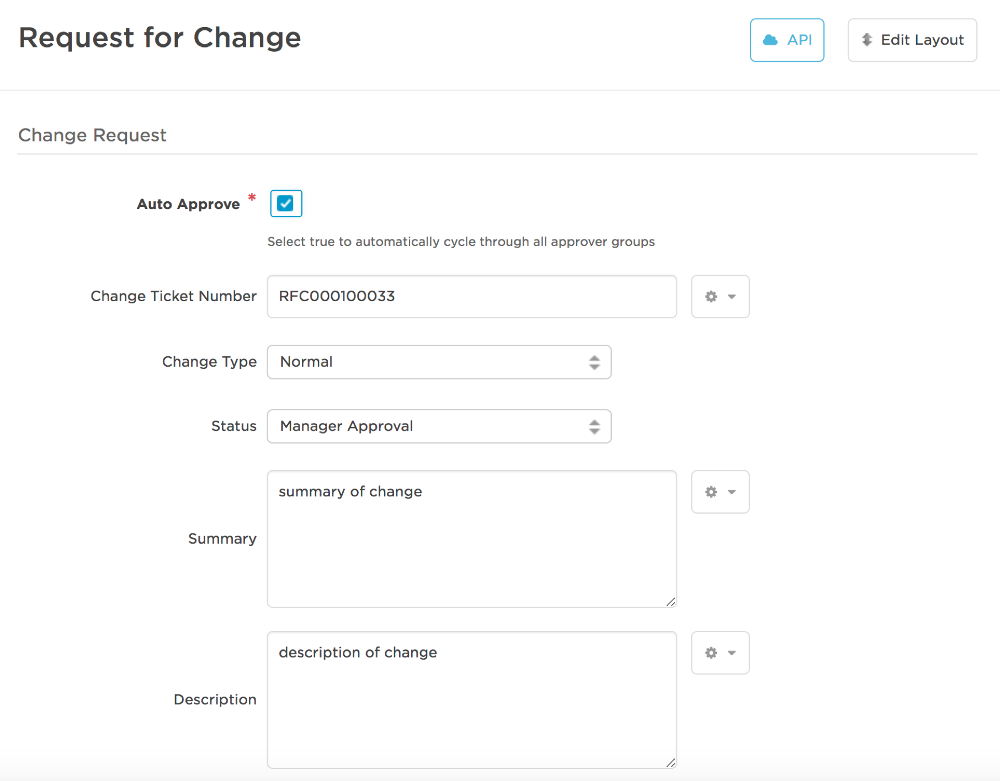
</kbd>
<kbd>
  
</kbd>
<kbd>
  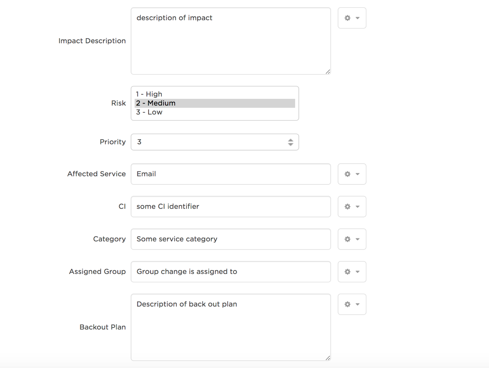
</kbd>

2. Change manager monitors the event:
<kbd>
  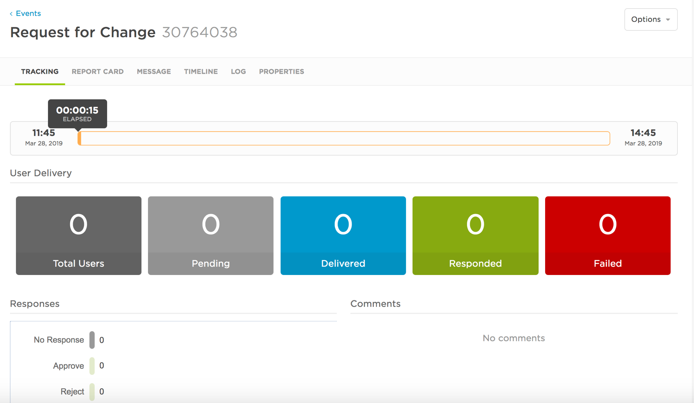
</kbd>

3. approval events are created for each defined approval stage:

<kbd>
  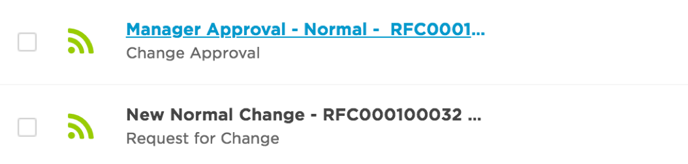
</kbd>

targeted approvers can Approve or Reject and then add comments:

<kbd>
  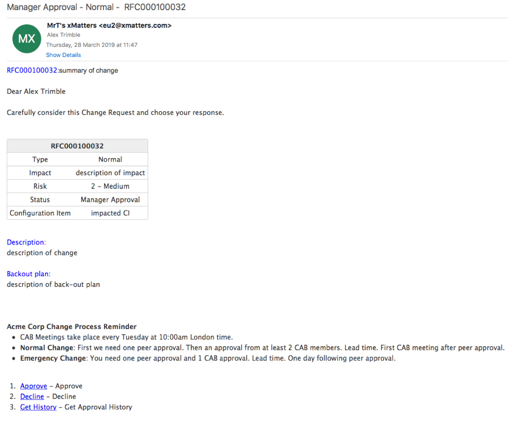
</kbd>

<kbd>
  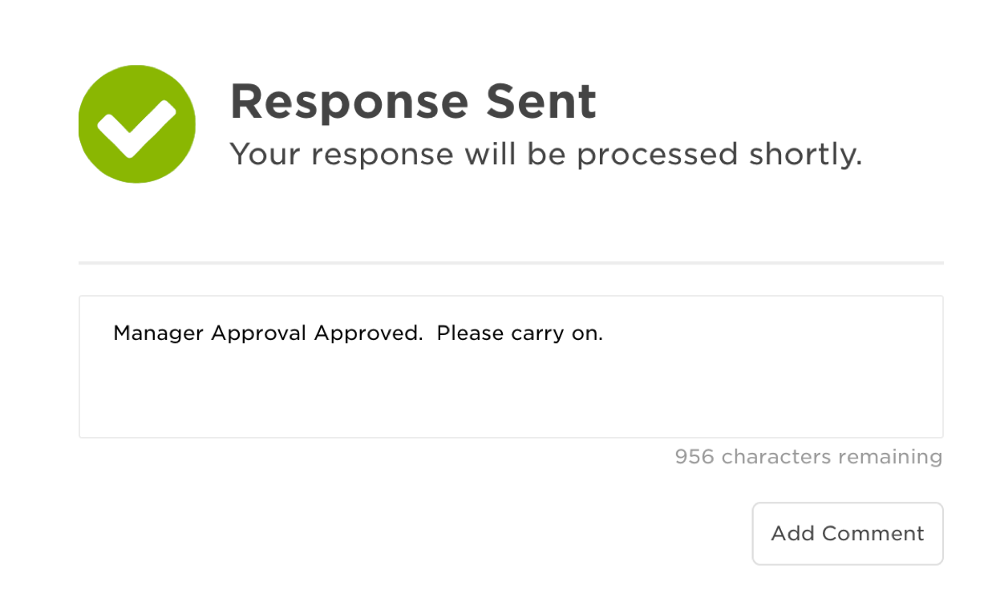
</kbd>

4. comments and next actions are recorded in the original event:

<kbd>
  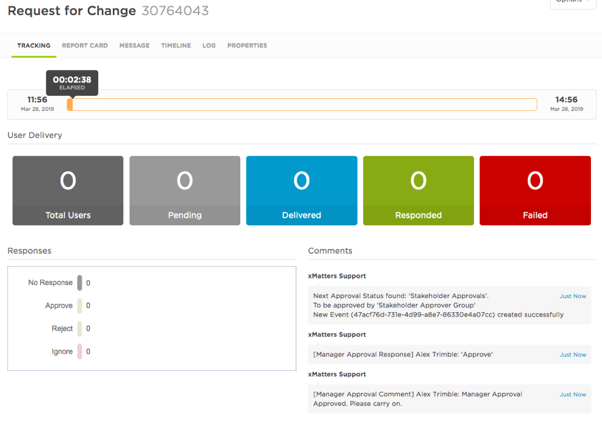
</kbd>

5. the next approval event is created:

<kbd>
  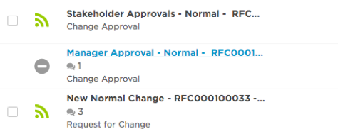
</kbd>

This repeats until all approvals have been completed or until any approval is rejected.

6. Approvers have a response option to get approval history.  This returns a list of all comments published to the original event:

<kbd>
  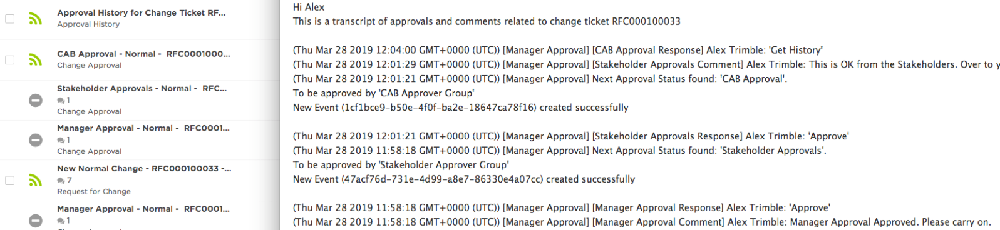
</kbd>

7. The system recognises and reports that all approval stages are complete allowing the change manager to progress the next stages manually:

<kbd>
  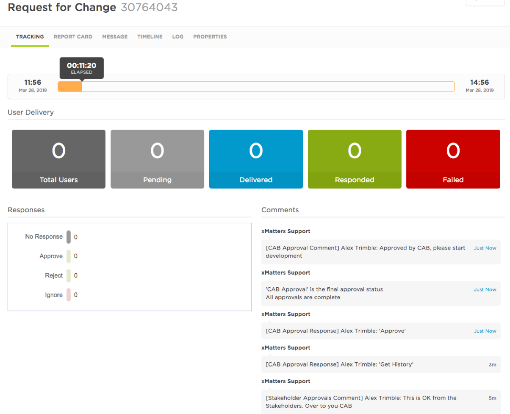
</kbd>

# Testing
Once configured as above initiate a new 'Request for Change' ensuring to select the 'Auto Approve' check box.

The above process should unfold.

Be sure to check the comments of the 'Request for Change' event as several comments can be written, for example if we have defined an approval stage but have not defined any approvers for the stage then the comments will let you know.

# Troubleshooting
Any  deviations from the above described process will need to be investigated in the activity stream.  Most likely in the Outbound response activity stream but bear in mind there are 2 inbound and 3 outbound integrations used to manage this process.

Its always worth double checking the constants are configured exactly as required as any variance of UUIDs or status names/list property names will stop the process.  Indeed the URL constants must be correct and identify their respective inbound integrations.
